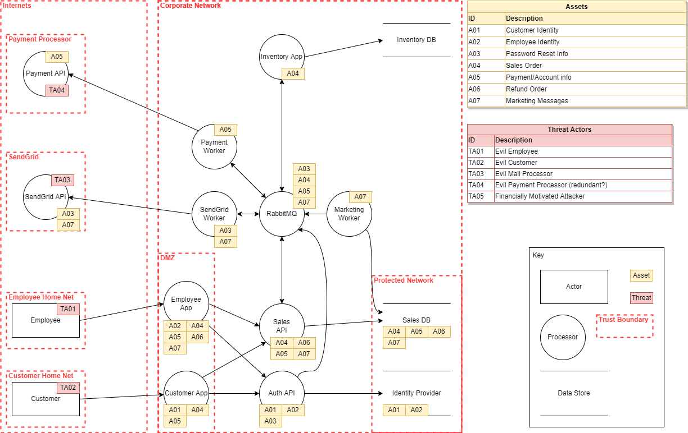
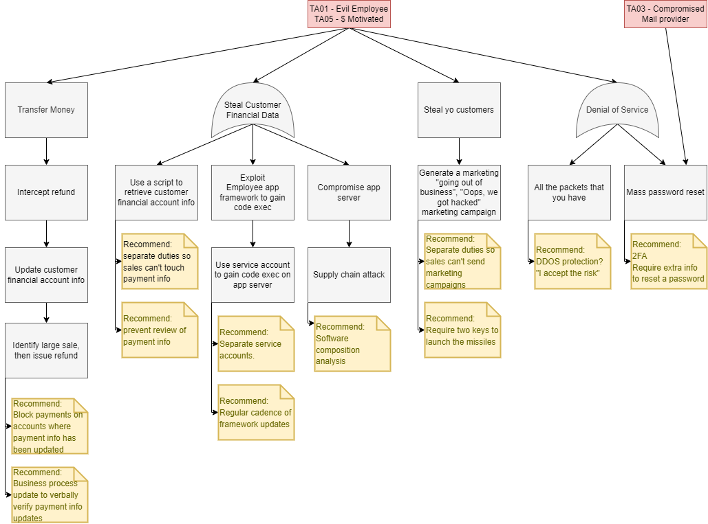
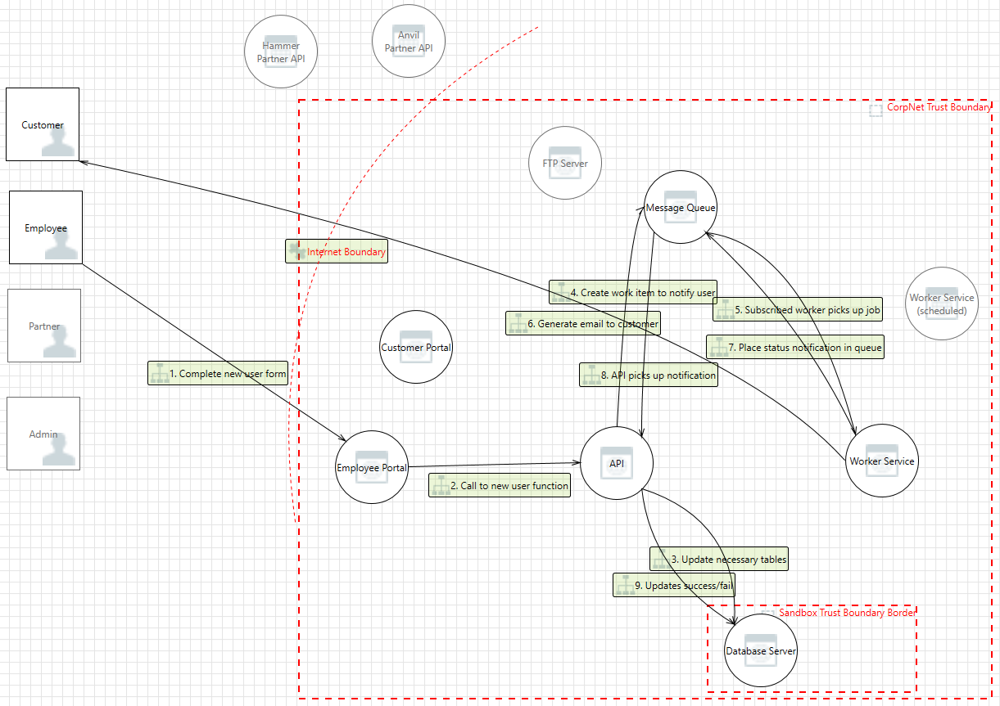

# Threat Modeling Playbook
Anything that exists only in your head is imaginary, and not doing useful work.

# Objective
- Systematically develop a model of a given system, including the intended users, what functionality it provides, and what sensitive data it holds.
- Identify potential adversaries, their objectives, and potential avenues of attacking the system.
- Identify existing protections which mitigate identified attacks, and gaps which are unprotected.
- For each gap estimate:
  - likelihood
  - attackers costs (opportunity, technical, monetary)
  - mitigation costs
- Present the results of this analysis to security & business leadership. Track issues to resolution or document acceptance of risk.
- Periodically review the model, updating as necessary for system changes & emergent threats.

This exercise should produce inventories, written narratives, diagrams, and work items.  Capture your knowledge and reasoning on the page so that others can review and enhance the model, and your organization can make informed decisions about which threats to counter.

## Questions to answer
* What are we working on?
* What can go wrong?
* How do we mitigate that?
* Did we do a good job?

# Methodology
## Foundational components
- inventory of systems/applications to be modeled
- an issue tracking mechanism

Both of these can exist as simple spreadsheets or be in an integrated enterprise inventory & work tracking system.

## Threat Model Composition
1. Narrative
2. Data Flow Diagram
   - Build process flows as necessary.
3. Attack Tree

While building the Narrative & Data Flow Diagrams you will want to capture issues in your issue tracking mechanism.
Build process flows if you encounter a feature or business process which is particularly complex or present attack opportunities that you can't capture any other way.

**Building Attack Trees**  
With the other artifacts in hand, build your attack tree. It is helpful to treat every actor & 3rd party as hostile, either through adversary compromise or insider threats. In addition, you should consider which external threat actors you're most concerned about. Examples include financially motivated attackers, activists, nation state actors, and corporate espionage/sabotage.

For each threat actor you've identified in the model, brainstorm a list of their objectives.  Identify the tactics & techniques necessary to achieve the objectives.  Note which of these are mitigated by existing controls.  Gaps should be captured in your issue list & evaluated.

If you get stuck, fall back on STRIDE. 

### Narrative & Notes
Capture
- Deployed environments & URLs
- System components
  - Actors/Users
  - Data processors
  - Data sinks/stores
  - Include 3rd party systems
- Authentication mechanisms & parameters
- Logging
  - Does the system produce intnernal logs
  - Are logs sanitized
  - Are logs forwarded to a central collection point
- Alerting
  - what events trigger alerts
  - are theere documented responses & escalation paths
- Users
  - How many roles are there?
  - How are permissions assigned?
- System/application features (repeat the following for each)
  - Narrative describing the feature:
    - what useful work it does
    - what data it collects & produces
      - classification & associated regulatory/compliance data can be helpful.
    - which components & 3rd parties are involved
    - where data is stored
- List of contributors and subject matter experts
- Version history

### Diagrams
**Data Flow** - Essential - Shows the system trust boundaries (firewalls & other security tooling), components (actors, processors, stores, 3rd parties), how components are connected, and how data moves through the system.  
Created with DrawIO:  

**Attack Trees** - Essential - Shows the objectives of an attacker at the top, with leaf nodes from each showing the logical steps to achieve that objective. The bottom of the attack tree can show mitigations, recommended fixes, or gaps to be addressed.  
Created with DrawIO:  

**Process Flow** - As Needed - Shows the system components (actors, processors, stores, 3rd parties), then shows sequenced connections which follow a particular process within the system (password resets, accepting a claim, completeing a sale)
These are very time consuming to produce and should not be generated for every process.  
Created with Microsoft Threat Modeling Tool:  

# Tools
## DrawIO
A cross platform, free diagramming tool. They offer a cloud tool or an application to download and create local diagrams. Michael Henriksen created a library for building dataflow & attack trees.

DrawIO has a tagging feature, where individual components can be assocaited with an arbitrary number of tags. The example in the DrawIO folder includes a fully tagged data flow diagram. (View -> Tags) If you hide Processors, then start hiding business processes (A01-A07) you'll see components drop away, leaving only the system components involved in the visible business processes.

https://www.diagrams.net/  
https://github.com/michenriksen/drawio-threatmodeling

## Microsoft Threat Modeling Tool
This is a highly customizable tool for building data flow diagrams & walking through each connection with STRIDE. The tool offers alot of opporunity to capture details about connections, component types, and natively enumertaes issues for review.

Opinion - This tool is really powerful and has alot of features, but I found myself getting lost in the details to get the automated STRIDE issues to make sense. Significant time has to be sunk in each model in order to get to rich, complete results. This trade-off drove me to Draw.IO and simpler diagrams, with manual analysis.

https://learn.microsoft.com/en-us/azure/security/develop/threat-modeling-tool  
https://aka.ms/threatmodelingtool 

## Notes & Links
Further Reading/Listening:

- https://www.threatmodelingmanifesto.org/
- https://raw.githubusercontent.com/geoffrey-hill-tutamantic/rapid-threat-model-prototyping-docs/master/18x26.Tutamen%20HOWTO-Rapid%20Threat%20Model%20Prototyping.pdf  
- https://github.com/OWASP/www-project-threat-modeling-playbook/blob/master/index.md  
- https://github.com/hysnsec/awesome-threat-modelling#tutorials-and-blogs  
- https://soundcloud.com/user-212326930/aug-2018-devsecops-rapid-threat-model-prototyping-talk-by-geoff-hill  
- https://www.schneier.com/academic/archives/1999/12/attack_trees.html

Remember kids: the only difference between screwing around and science is writing it down.
Don't screw around in security.  

